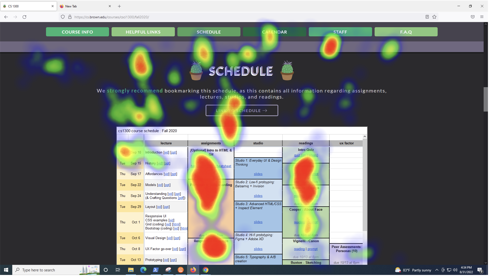
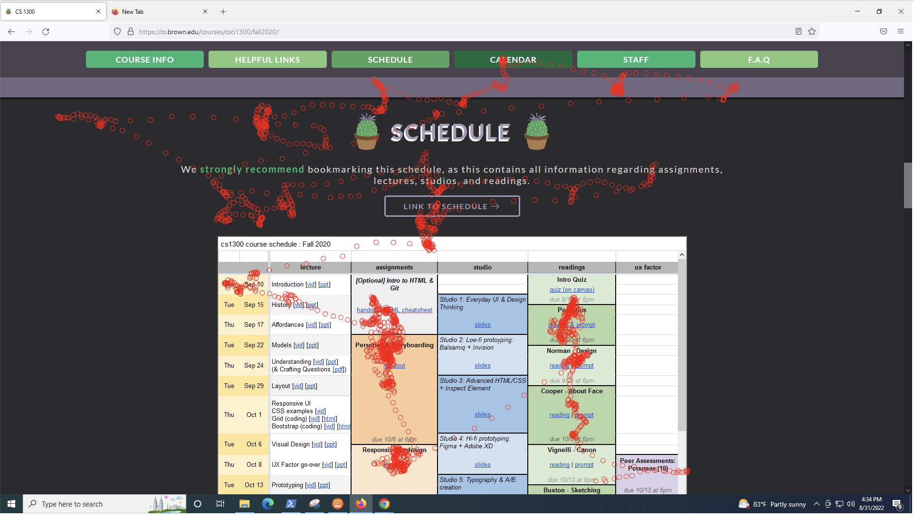

# cs1300-eyetracking

To analyze the eye tracking data that you have collected, you will generate a heatmap and a replay that depicts the areas where your participant's gaze was focused. 

## STEPS:
<!-- 1. If you don't have Git installed, make sure to [download it here](https://git-scm.com/downloads) and install it. 
2. Open Terminal (on Mac) or PowerShell (on Windows) and navigate to the desired folder you are using for course materials. If you’re not familiar with navigating to folders in Terminal/PowerShell, there’s a guide [here](https://docs.google.com/document/d/1Kp-R4iFiPzGp0NMpGH_eTQyKt6Ptq20GrtnsBJ8S2SM/edit?usp=sharing) -->
1. Once you're in the desired folder, download the project files using `git clone https://github.com/cs1300-2022/cs1300-eyetracking.git`
2. Copy or move your data files from eye tracking into the downloaded folder (for each eye tracking session, there should be a CSV file and a screenshot)
3. For each session, generate a heatmap and a replay using the following code:

### heatmap.html generates a static density map of the areas users were looking
1. Open **heatmap.html** in a text editor and fill in the TODOs, which involve filling in file names and the dimensions of your screenshot (so that the heatmap can be properly overlayed).
### replay.html creates an animated replay of users' eye gaze movements
1. Similar to heatmap.html, open **replay.html** in a text editor and fill in the TODOs. One of the TODOs involves setting the variable `isPersistent`, which by default is true. Feel free to play around with this :) 
2. This file will render an animation of the eye tracking path of the user using circles. Imagine a pen leaving a trail exactly where your eye has been looking. Note that setting `isPersistent` to false will not leave a lasting trail. 

### start a Python server to render results
1. If you do not have Python, download and install it [for Mac](https://www.python.org/ftp/python/3.6.3/python-3.6.3-macosx10.6.pkg) or [for Windows](https://www.python.org/downloads/release/python-363/).
2. To test your code, open the Terminal, navigate to the folder that contains heatmap.html and replay.html, and run the following command to launch your Python server (to check what version of python you have, you can run python --version in your terminal):
    - If you have Python2: `python -m SimpleHTTPServer 8000`
    - If you have Python3: `python -m http.server 8000` or `python3 -m http.server 8000`
3. Once your Python server is running, the visualizations will be displayed at this URL
(remember to navigate to the proper directory when setting up the server):
http://localhost:8000/heatmap.html and http://localhost:8000/replay.html
4. For _each_ eye tracking session, take **3 screenshots** of your work:
    - Your heatmap.
    - An “action shot” of replay.html (i.e. before it’s done drawing)
    - A final shot of replay.html at the end of the drawing stage
5. Include those screenshots with your modified prototypes in your final handin. In
total, you should have 6 screenshots (3 screenshots each for 2 eye tracking sessions).
6. Write 2-3 sentences interpreting results of your visualization. Did the results match
your expectations you set out in your qualitative eye tracking hypothesis?

Thanks to Angel Cheung, Jeff, and other F2019 TAs 
